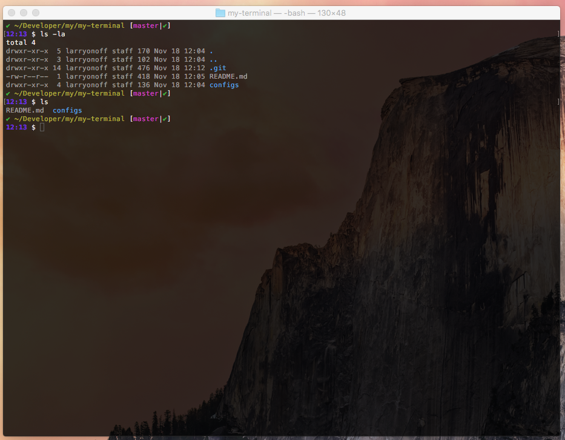

# Terminal Ilya is using



- [Homebrew](http://brew.sh)
- **coreutils** via brew
- [dircolors-solarized](https://github.com/seebi/dircolors-solarized)
- [rbenv](https://github.com/sstephenson/rbenv)
- [bash-completion](https://bash-completion.alioth.debian.org)
- [grc](http://korpus.juls.savba.sk/~garabik/software/grc.html)
- [bash-git-prompt](https://github.com/magicmonty/bash-git-prompt)
- [Atom](https://atom.io)


# How to
1. Install Homebrew ```ruby -e "$(curl -fsSL https://raw.githubusercontent.com/Homebrew/install/master/install)"```
2. ```brew install coreutils bash-completion bash-git-prompt git grc rbenv ruby-build```
3. Copy contents of ```config``` folder into your home folder
4. Check available ruby versions with command ```rbenv install -l```
5. Install appropirate ruby version, e.g. ```rbenv install 2.2.3``` then ```rbenv global 2.2.3```
